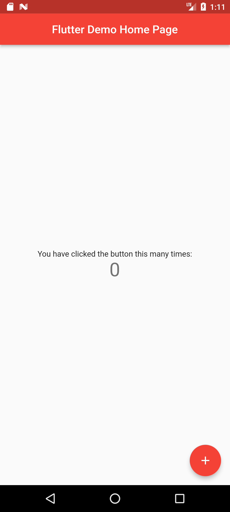
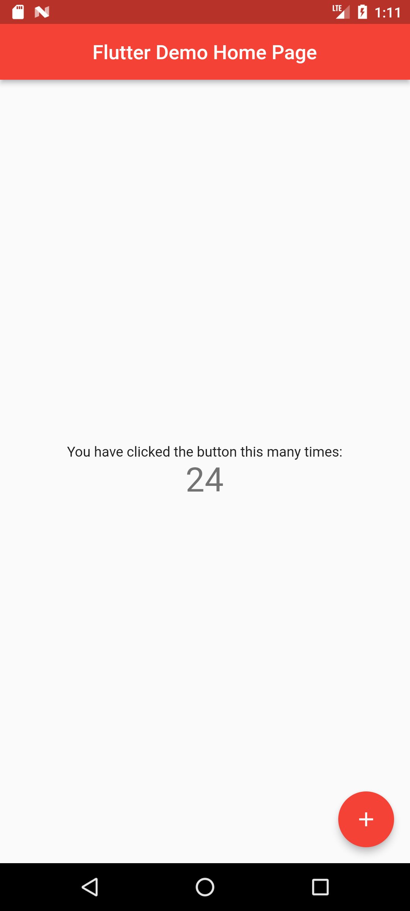

<h1 align="center">Flutter Demo</h1>

A simple flutter Demo App.

It is a single screen App that displays a line of text and a counter on the screen.
The counter increments every time the user taps the 'increment' button in the bottom
right corner of the screen.

<h3>Widgets Used</h3>
<ul>
<li>MaterialApp</li>
<li>ThemeData</li>
<li>Scaffold</li>
<li>AppBar</li>
<li>Text</li>
<li>Center</li>
<li>Column</li>
<li>FloatingActionButton</li>
<li>Icons</li>
</ul>

<h3>Screenshots</h3>

