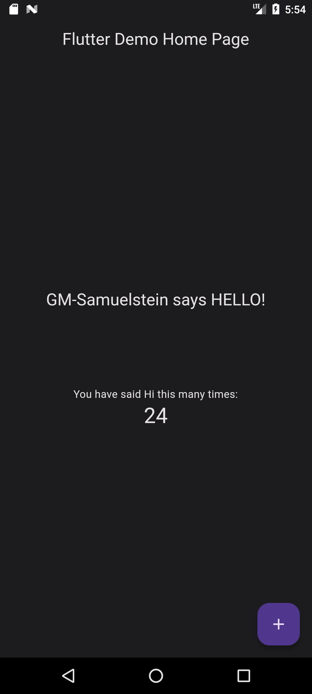

<h1 align="center">Flutter Demo</h1>

A simple flutter Demo App.

It is a single screen App that displays a line of text and a counter on the screen.
The counter increments every time the user taps the 'increment' button in the bottom
right corner of the screen.

<h2 align="center">Screenshots</h2>

<h4>Home page</h4>

