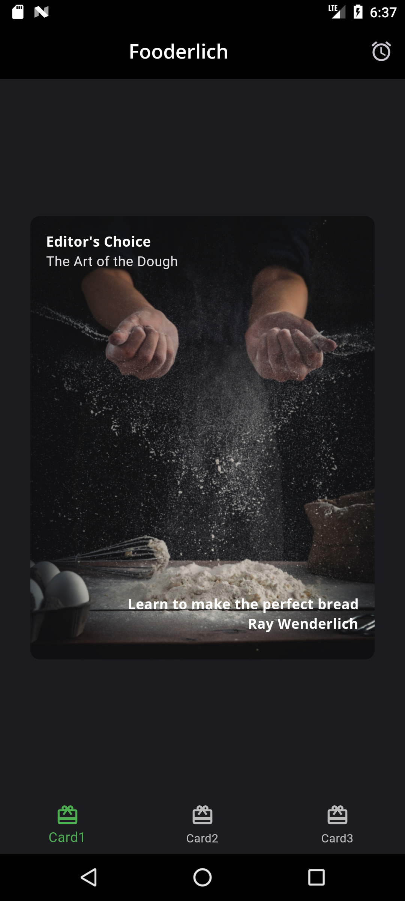
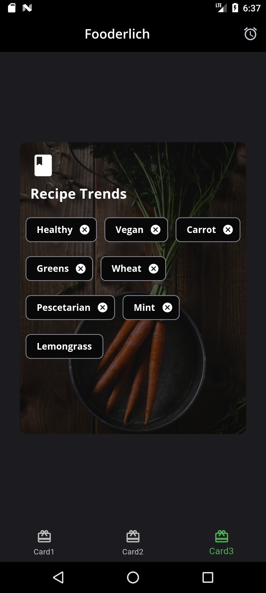
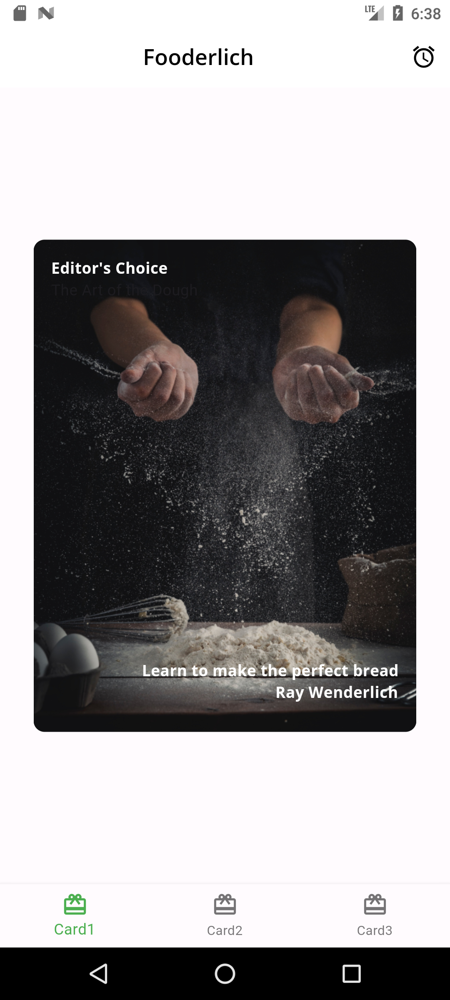
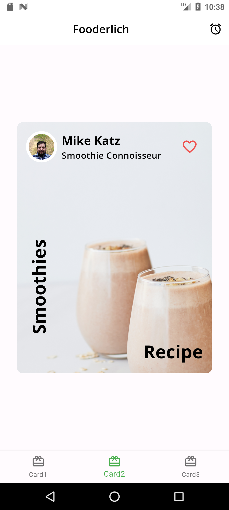
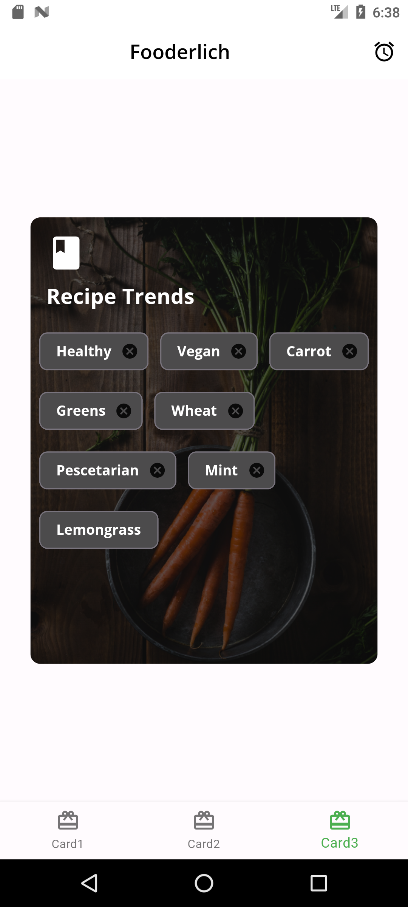
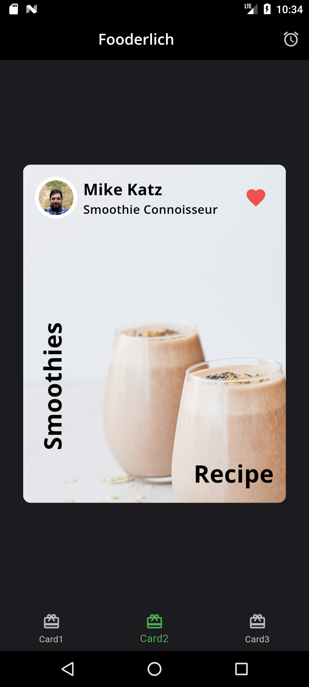
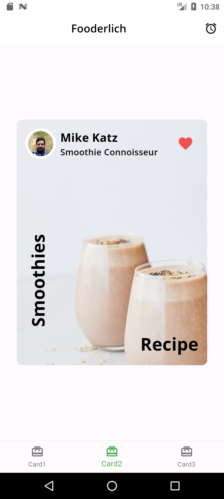
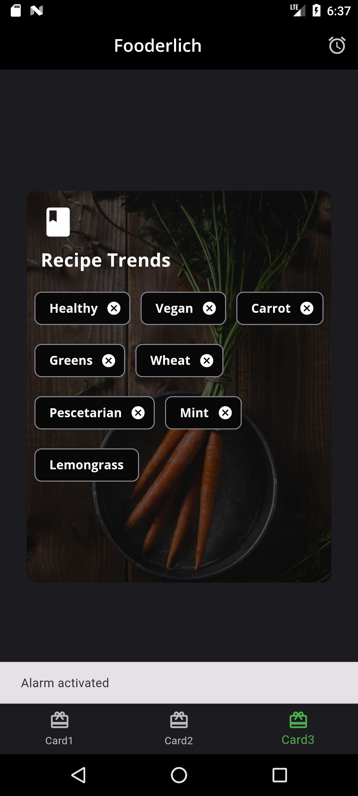
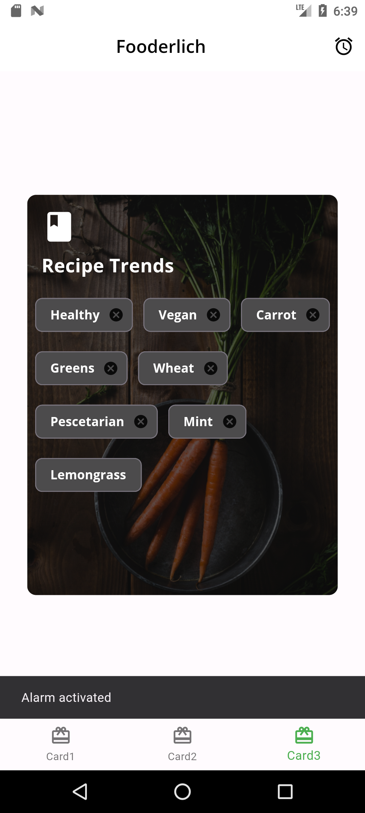

<h1 align="center">Fooderlich</h1>

A social recipe app for keeping track of new dishes.

The app has its own custom theme of light mode and dark mode. The app has a bottom navigation bar that navigates the screen between different cards.

<h2 align="center">Sreenshots.</h2>
<h4>Dark Mode</h4>

<h4>Light Mode</h4>

<h4>Card2 Favorite Snackbar</h4>

When the favorite button in card2 is clicked, it toggles the favorite icon.

<h4>AppBar Alarm Action</h4>

There is an alarm icon on the appbar that displays a message at the bottom of the screen when activated.

