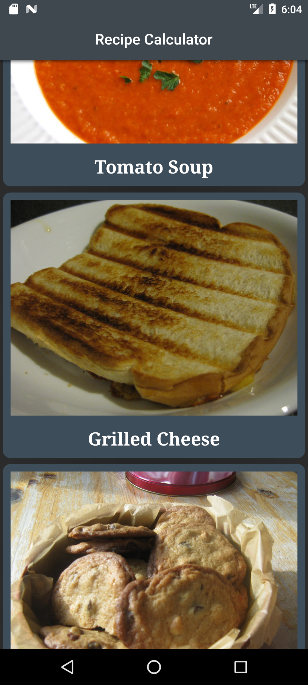
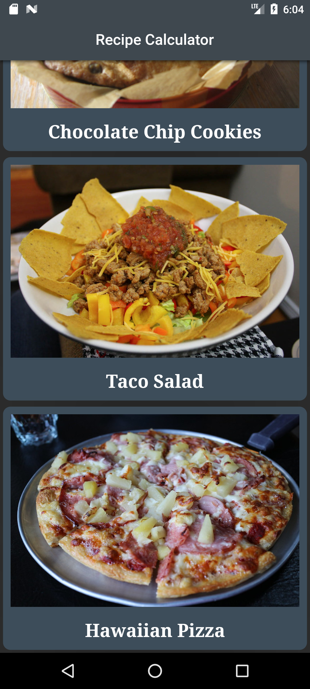
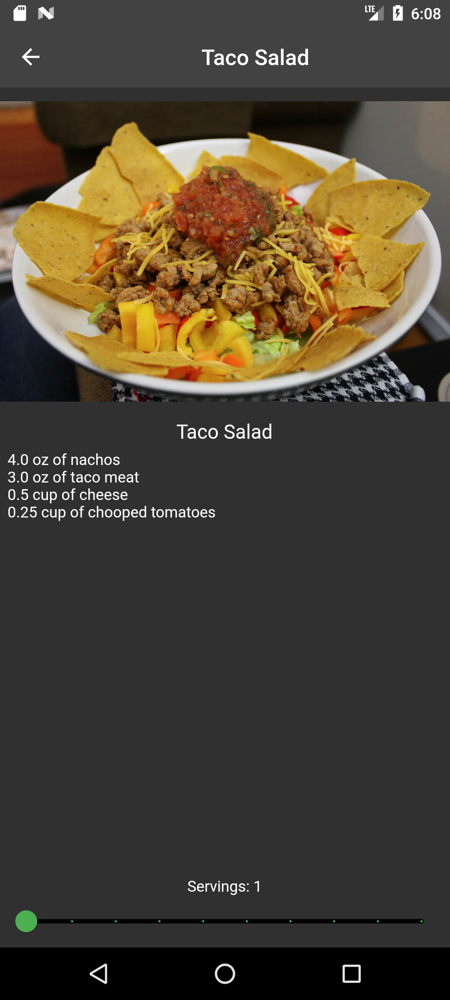

<h1 align="center">Recipes</h1>

An app that calculates the quantities of ingredients needed for a given recipe.

The homepage of the app displays different recipe-samples. The app is interactive and clicking on any recipe-sample takes you to another page(Recipe-Detail) that displays the sets of ingredients needed to make that particular recipe-sample.

At the bottom of the recipe-detail page is the current number of servings. Adjusting the slider changes the number of servings and recalculates the amount of ingredients needed.

<h2 align="center">Sreenshots.</h2>

<h4>Home page</h4>

<h4>Recipe detail page</h4>

<h2 align="center">Demonstration</h2>

https://github.com/GM-Samuelstein/Flutter_Apprentice/assets/104820502/1b6bbc8c-0681-4be2-9ed9-2a07cf7df087

