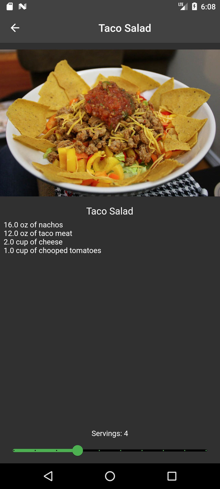
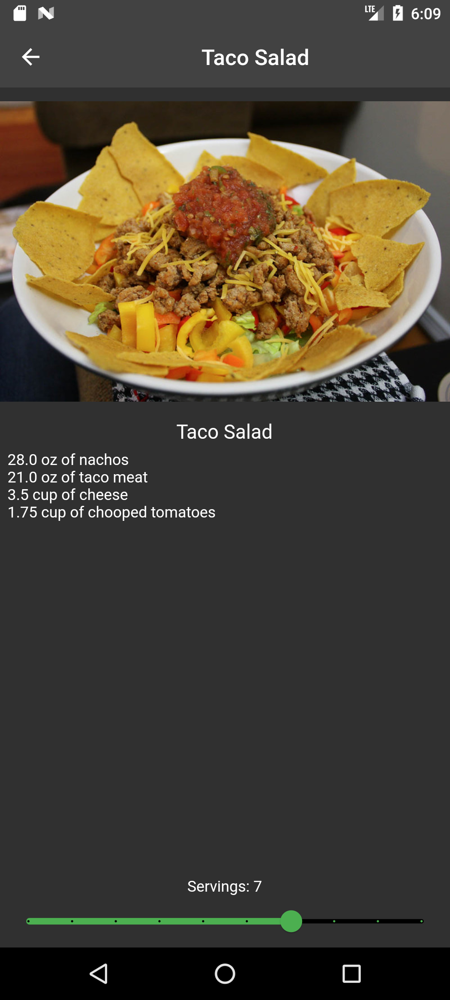

<h1 align="center">Recipe Calculator</h1>

An app that calculates the quantities of ingredients needed for a given recipe.

The homepage of the app displays different recipe samples. The app is interactive and clicking on any recipe takes you to another page(Recipe Detail) that displays the sets of ingredients needed to make that particular recipe.

At the bottom of the recipe detail page is the current number of servings. Adjusting the slider changes the number of servings and recalculates the amount of ingredients needed.

<h2 align="center">Sreenshots.</h2>

<h4>Home page</h4>

<h4>Recipe detail page</h4>

